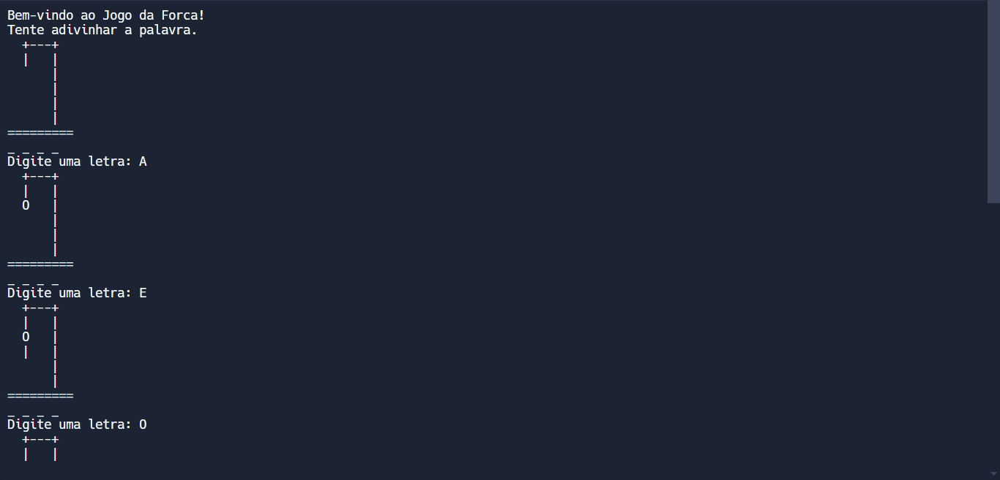
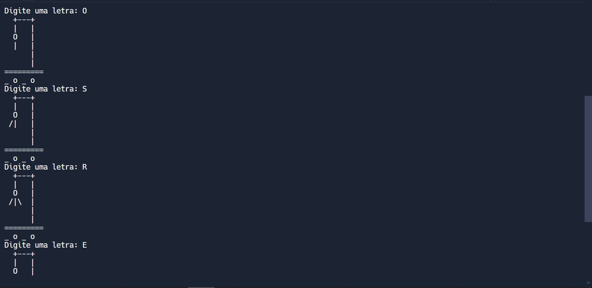
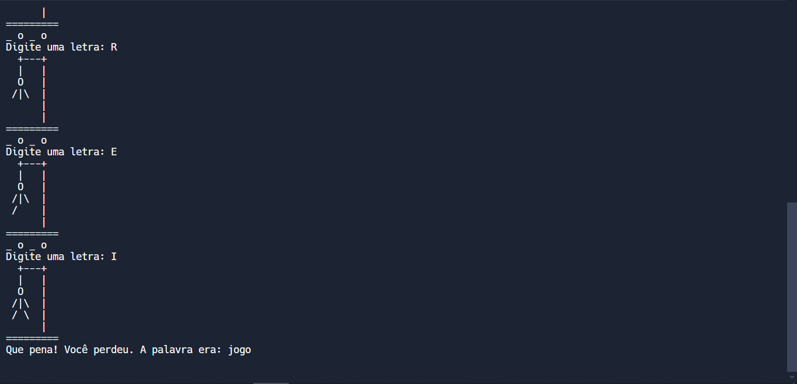

# JOGO DA FORCA EM C
👨‍💻ESSE É PEQUENO JOGO QUE RODA NO CONSOLE DA IDE.

 <br>
 <br>
 <br>

## DESCRIÇÃO:
O **Jogo da Forca** é um jogo clássico em que o jogador tenta adivinhar uma palavra oculta, letra por letra, antes de ficar sem tentativas. Neste jogo, a palavra a ser adivinhada é escolhida aleatoriamente a partir de um arquivo de texto. 

O objetivo é adivinhar a palavra oculta antes de esgotar todas as tentativas disponíveis. O jogador deve inserir letras e, com base nas tentativas, a palavra será revelada gradualmente.

## COMO FUNCIONA?
1. **Leitura da Palavra:**
   - O jogo lê um arquivo de texto (`word.txt`) contendo uma lista de palavras. Ele escolhe uma palavra aleatoriamente a partir desta lista.

2. **Exibição da Forca:**
   - O jogo mostra uma representação gráfica simples da forca, com base no número de erros cometidos pelo jogador.

3. **Entrada do Jogador:**
   - O jogador deve inserir uma letra para tentar adivinhar a palavra. O jogo verifica se a letra está na palavra e atualiza a visualização da palavra e a forca de acordo com o número de erros.

4. **Condições de Vitória e Derrota:**
   - O jogador vence se conseguir adivinhar todas as letras da palavra antes de cometer o número máximo de erros.
   - O jogador perde se cometer erros suficientes para completar a forca.

## EXECUTANDO O JOGO:
### COMO EXECUTAR O CÓDIGO?
1. **Preparar o Arquivo de Palavras:**
   - Você pode adicionar mais palavrar em `./CODIGO/word.txt`; Insira uma palavra por linha. Por exemplo:

     ```
     programacao
     lua
     jogo
     computador
     forca
     ```

2. **Compilar o Código:**
   - Abra um terminal ou prompt de comando e navegue até o diretório `./CODIGO`.
   - Compile o código com o seguinte comando (certifique-se de ter o compilador GCC instalado):

     ```bash
     gcc -o CODIGO CODIGO.c
     ```

3. **Executar o Programa:**
   - Execute o programa com o comando:

     ```bash
     ./CODIGO
     ```

### COMO JOGAR?
1. **Início do Jogo:**
   - Ao iniciar, o jogo escolherá uma palavra aleatória do arquivo `word.txt` e exibirá a forca inicial com um número de traços correspondentes às letras da palavra.

2. **Fazer Palpites:**
   - Você será solicitado a digitar uma letra. O jogo verificará se a letra está na palavra e atualizará a exibição da palavra e a forca.

3. **Visualização da Forca:**
   - A cada erro, a forca será desenhada progressivamente para indicar quantas tentativas restam.

4. **Vencer ou Perder:**
   - O jogo termina quando você adivinha todas as letras da palavra ou quando o número máximo de erros é alcançado. O resultado será exibido, mostrando se você venceu ou perdeu e qual era a palavra oculta.

## NÃO SABE?
- Entendemos que para manipular arquivos em muitas linguagens e tecnologias, é necessário possuir conhecimento nessas áreas. Para auxiliar nesse aprendizado, oferecemos cursos gratuitos disponíveis:
* [CURSO DE C](https://github.com/VILHALVA/CURSO-DE-C)
* [CONFIRA MAIS CURSOS](https://github.com/VILHALVA?tab=repositories&q=+topic:CURSO)

## CREDITOS:
- [PROJETO CRIADO PELO VILHALVA](https://github.com/VILHALVA)
